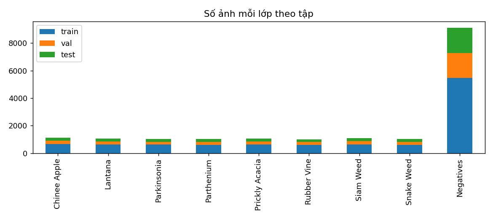
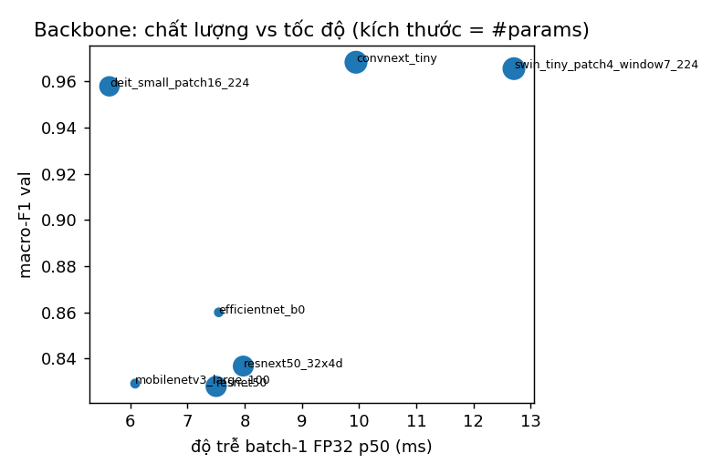
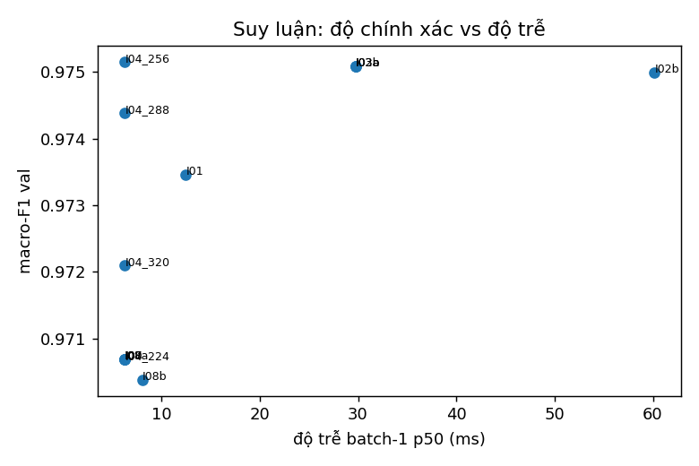
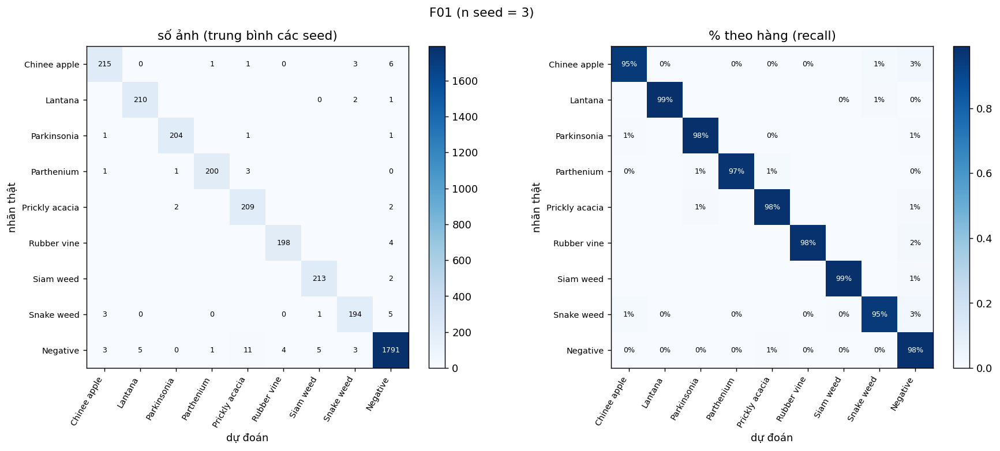
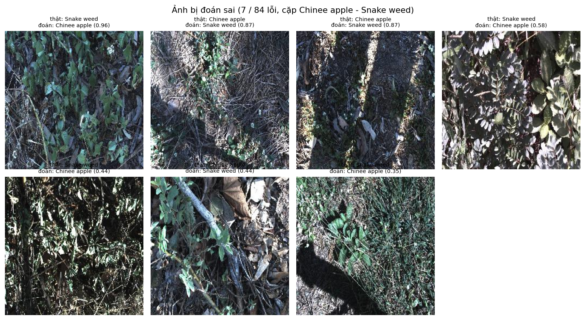
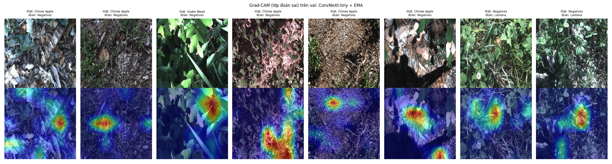

# Báo cáo Lab Day 2 — Backbone, công thức huấn luyện và suy luận trên DeepWeeds

Ngô Đức Chung · 2A202602985 · Track 4 · Ngày 2. Mọi số liệu lấy từ `results.xlsx`, `eval_results/` và `predictions/` (tính lại bằng `eval.py` gốc, không sửa). Chữ "val" là tập val fold 0, "test" là tập test fold 0.

## 1. Tóm tắt

- **Bài toán:** phân loại 9 lớp ảnh cỏ dại DeepWeeds (17.509 ảnh, fold 0 chia sẵn 60/20/20, `Negative` chiếm 52%). Chỉ số chính là macro-F1.
- **Đã làm:** 7 backbone (1 seed), 12 thí nghiệm công thức huấn luyện thuộc cả 7 trục A–G (1 seed, mỗi lần chỉ đổi một yếu tố), 8 phương pháp suy luận ngoài mốc kèm độ trễ p50/p95/p99, ma trận Lab #2 của slide (3 cách khởi tạo × có/không CutMix × 3 seed), một tổ hợp nhiều yếu tố (T21, 3 seed), và chung kết 3 seed cùng mốc `T00` 3 seed.
- **Cấu hình tốt nhất (F01):** ConvNeXt-tiny (`convnext_tiny.in12k_ft_in1k`), công thức nền `T00` 10 epoch + EMA 0,99, suy luận TTA 5 crop + temperature scaling (T khớp trên val). Chọn hoàn toàn bằng val; test chạy một lần mỗi seed.
- **Kết quả test (mean ± std, 3 seed):** top-1 **97,91 ± 0,29%**, macro-F1 **0,9738 ± 0,0035**, ECE 0,0057 ± 0,0011; recall Chinee apple 95,3 ± 1,4%, Snake weed 94,9 ± 1,0%. Độ trễ p95 batch-1 là 31,8 ms (T4).
- **So với mốc** (`T00` + 1 view, 3 seed): macro-F1 0,9710 ± 0,0048, top-1 97,66 ± 0,38%. Chênh macro-F1 là +0,0027, **nhỏ hơn độ lệch chuẩn giữa các seed (0,0048), nên không phân biệt được** F01 với mốc.
- **Kết luận chính:** yếu tố quyết định là **chọn backbone/trọng số tiền huấn luyện** (ConvNeXt, Swin, DeiT đạt macro-F1 val ≥ 0,958 còn các CNN còn lại 0,83–0,86); mọi yếu tố công thức và suy luận chỉ thay đổi trong cỡ nhiễu giữa các lần chạy (~0,003–0,01).
- **Bài làm thêm (chỉ val):** DINOv2 linear probe (0,874 so với 0,971 khi tinh chỉnh), lệch phân phối (làm mờ phá hủy mô hình: macro-F1 0,35), Grad-CAM cho ca bị nhầm, ONNX (nhanh hơn PyTorch ≈1,23× trên CPU), và cấu hình cuối trên 3 fold (top-1 0,9781 ± 0,0020, macro-F1 0,9724 ± 0,0024) — mục 9.
- **Điều cần biết (trung thực):** máy ảo Colab bị thu hồi giữa chừng nên một phần ablation phải chạy lại trên Kaggle (mục 2.3). Số liệu của các lần chạy đã mất log được ghi riêng ở Phụ lục B và không dùng để kết luận.

## 2. Dữ liệu và thiết lập

### 2.1 Dữ liệu và kiểm tra bắt buộc
Fold 0 nguyên bản của tác giả (không sửa, không lọc). Số ảnh train/val/test là **10.501 / 3.501 / 3.507** (59,97% / 20,00% / 20,03%); giao từng cặp tập đều bằng 0; hợp ba tập đúng 17.509; không thiếu file (`tables/split_check.json`). `Negative` có 9.106 ảnh (khớp Table 1 của bài báo), mỗi loài 1.009–1.125 ảnh; tỉ lệ lớp nhiều nhất/ít nhất là 9,03 (`tables/class_counts.csv`, `tables/eda_class_distribution.png`, ảnh mẫu ở `tables/eda_samples.png`). Do mất cân bằng, top-1 bị `Negative` kéo cao nên luôn đọc kèm macro-F1.

### 2.2 Kiểm tra pipeline trước khi chạy thật (`tables/pipeline_checks.json`)
Loss ban đầu của head mới 2,181 (kỳ vọng ln 9 = 2,197); overfit 16 ảnh: loss 2,209 → 0,0001; ảnh sau augmentation khớp nhãn (`tables/augmented_*.png`); `model.eval()` và `torch.inference_mode()` khi đánh giá. 34 test tự viết cho code (focal γ=0 ≡ CE, CutMix trộn cả nhãn và tính lại λ theo diện tích thật, weight decay không áp lên norm/bias, BN đóng băng ở eval, gộp BN, resume ≡ chạy liền, `eval.py` contract...) đều qua (`logs/unittest_local.txt`).

### 2.3 Công thức nền T00, môi trường, seed, và hai lượt chạy
- **T00:** trọng số tiền huấn luyện ImageNet (tag timm ghi ở sheet Backbones), head mới 9 lớp, tinh chỉnh toàn bộ; train: `RandomResizedCrop(224)` + lật ngang; val/test: ảnh 256 `CenterCrop(224)`; chuẩn hoá ImageNet; AdamW, LR backbone 1e-4, head 1e-3, weight decay 0,05 (không áp cho norm/bias), warmup 1 epoch rồi cosine; cross-entropy; batch 64; **10 epoch** (GUIDE cho 10–15; chọn 10 vì ngân sách GPU); AMP; chọn checkpoint theo macro-F1 val (hòa lấy epoch sớm).
- **Phần cứng:** Tesla T4 (Colab và Kaggle), PyTorch 2.11 (cu130 trên Colab, cu128 trên Kaggle), timm 1.0.29. **Seed:** mốc và chung kết 0, 1, 2; backbone và hầu hết ablation seed 0.
- **Các lượt chạy (hai lượt chính và một lượt phụ).** *Lượt 1 (Colab):* Bước 0, Bước 1, T00 × 3 seed, các ablation T14, T09, T03 và phần còn lại của ablation; sau khoảng 6 giờ GPU free cạn hạn mức và máy ảo bị thu hồi, mất checkpoint và các kết quả chưa kịp sao lưu. Phần đã sao lưu nằm ở `run_logs_colab_run1/`, `predictions/` (B01–B07, T03, T09, T14), `predictions/colab_run1/` (T00), `logs/progress_colab_run1.log`. *Lượt 2 (Kaggle, notebook `lab_day2_recovery.ipynb`):* chạy lại phần bắt buộc còn thiếu với đúng các quyết định đã chốt bằng val ở lượt 1: F01 và T00 × 3 seed + test một lượt mỗi seed, Bước 3, ma trận Lab #2, các ablation T04, T08, T10, T11, T12, T17, T02, và ensemble. *Lượt 3 (Kaggle, `lab_day2_combo.ipynb`):* chỉ thí nghiệm tổ hợp T21 trên val, chạy sau chung kết. Các cột `lượt` trong `results.xlsx` ghi rõ số liệu thuộc lượt nào; Δ của mỗi ablation chỉ so với `T00` **cùng lượt**.
- **Nhiễu giữa hai lượt chạy:** cùng cấu hình và seed nhưng khác nền tảng, ConvNeXt-tiny T00 seed 0 cho macro-F1 val 0,9719 (Colab) và 0,9663 (Kaggle); `B03` cho 0,9683 và 0,9663. Trên cùng một máy, chạy lại cùng seed cho đúng cùng số (`B03` ≡ `T00` seed 0 trên Kaggle).

## 3. So sánh backbone (Bước 1, công thức T00, seed 0, trên val)

| exp_id | backbone | tag trọng số | tham số (M) | GMAC | macro-F1 val | top-1 val | s/epoch | p50 batch-1 (ms) |
|---|---|---|---|---|---|---|---|---|
| B01 | resnet50 | a1_in1k | 23,5 | 4,09 | 0,8280 | 0,8698 | 40 | 7,5 |
| B02 | resnext50_32x4d | a1h_in1k | 23,0 | 4,23 | 0,8368 | 0,8749 | 51 | 8,0 |
| **B03** | **convnext_tiny** | in12k_ft_in1k | 27,8 | 4,45 | **0,9683** | **0,9757** | 54 | 9,9 |
| B04 | deit_small_patch16_224 | fb_in1k | 21,7 | 4,60 | 0,9578 | 0,9697 | 38 | 5,6 |
| B05 | swin_tiny_patch4_window7_224 | ms_in1k | 27,5 | 4,49 | 0,9655 | 0,9740 | 70 | 12,7 |
| B06 | efficientnet_b0 | ra_in1k | 4,0 | 0,38 | 0,8600 | 0,8943 | 35 | 7,5 |
| B07 | mobilenetv3_large_100 | ra_in1k | 4,2 | 0,22 | 0,8292 | 0,8718 | 31 | 6,1 |

- **Chọn ConvNeXt-tiny** vì macro-F1 val cao nhất và độ trễ batch-1 chỉ 9,9 ms (≪ ngân sách 100 ms). Swin-tiny kém hơn 0,003 (trong cỡ nhiễu) nhưng chậm gấp 1,3 lần, nên không có đánh đổi nào khiến phải chọn khác; DeiT-S nhanh nhất trong nhóm khá (5,6 ms) với F1 thấp hơn 0,01.
- **Khoảng cách lớn (≈0,13) giữa nhóm ConvNeXt/Swin/DeiT và các CNN còn lại là kết quả 1 seed nhưng vượt xa nhiễu (≈0,003–0,01).** Tôi **không** tách được nguyên nhân: các bộ trọng số `a1`/`a1h` của ResNet được tạo bằng công thức "ResNet strikes back" (BCE, LAMB, augmentation mạnh) có thể không hợp với tinh chỉnh bằng CE + AdamW LR 1e-4 trong 10 epoch, và ConvNeXt dùng trọng số ImageNet-12k. Đây là giả thuyết, chưa có thí nghiệm kiểm chứng (cần thử ResNet với tag trọng số khác).
- **FLOPs không dự đoán độ trễ:** EfficientNet-B0 (0,38 GMAC) có p50 7,5 ms bằng ResNet-50 (4,09 GMAC); MobileNetV3 (0,22 GMAC) chỉ nhanh hơn ResNet-50 20%.
- Đường cong (`curves/B0x_*.png`, `run_logs_colab_run1/B0x/seed0/history.csv`): ConvNeXt-tiny đạt macro-F1 val 0,88 ngay epoch 1 và 0,94 sau epoch 4 (hội tụ nhanh nhất; Swin 0,94 ở epoch 4, DeiT 0,90). **ResNet-50 chưa khớp:** loss train cuối 0,42 ≈ loss val 0,40 và F1 val dừng quanh 0,82–0,83 ở epoch 8–10. **ResNeXt-50, EfficientNet-B0 và MobileNetV3 có dấu hiệu quá khớp nhẹ:** loss val thấp nhất ở epoch 8 rồi tăng (0,367 → 0,391; 0,325 → 0,354; 0,388 → 0,425) trong khi loss train vẫn giảm; checkpoint chọn theo val nên lấy epoch sớm hơn. ConvNeXt, Swin và DeiT không quá khớp (loss val phẳng ≈0,10 ở cuối).

## 4. Công thức huấn luyện (Bước 2)

Mỗi dòng chỉ khác T00 đúng một yếu tố, cùng backbone (ConvNeXt-tiny), cùng 10 epoch (trừ T17), seed 0. σ là độ lệch chuẩn mẫu của T00 qua 3 seed **cùng lượt**: 0,0016 (Colab) và 0,0042 (Kaggle). Δ là chênh macro-F1 val so với T00 seed 0 cùng lượt.

| exp_id | lượt | trục | khác T00 | macro-F1 val | Δ (σ) | kết luận |
|---|---|---|---|---|---|---|
| T00 (mốc, 3 seed) | Colab | – | – | 0,9700 ± 0,0016 | – | – |
| T14 | Colab | E | LR 3e-4 / 3e-3 | 0,9671 | −0,0048 (−3,0σ) | tệ hơn mốc |
| T09 | Colab | C | label smoothing 0,1 | 0,9728 | +0,0009 (0,6σ) | không phân biệt được |
| T03 | Colab | B | lật dọc + xoay 90° | 0,9721 | +0,0002 (0,1σ) | không phân biệt được |
| T00 (mốc, 3 seed) | Kaggle | – | – | 0,9710 ± 0,0042 | – | – |
| T04 | Kaggle | B | đổi màu | 0,9619 | −0,0044 (−1,0σ) | không phân biệt được |
| T08 | Kaggle | B | CutMix | 0,9738 | +0,0076 (1,8σ) | gần ngưỡng |
| T10 | Kaggle | C | focal γ=2 | 0,9682 | +0,0019 (0,5σ) | không phân biệt được |
| T11 | Kaggle | C | CE trọng số lớp | 0,9771 | +0,0108 (2,6σ) | xem lưu ý dưới |
| T12 | Kaggle | D | sampler cân bằng | 0,9669 | +0,0006 (0,1σ) | không phân biệt được |
| T17 | Kaggle | G | 20 epoch | 0,9744 | +0,0081 (1,9σ) | gần ngưỡng |
| F01 seed 0 | Kaggle | F | EMA 0,99 | 0,9704 | +0,0041 (1,0σ) | không phân biệt được |
| T21 (3 seed) | Kaggle (lượt 3) | tổ hợp | CE trọng số lớp + CutMix + EMA | 0,9600 ± 0,0010 | −0,0110 so với mean T00 (−2,6σ) | **tệ hơn mốc** (triệt tiêu) |
| T02 | Kaggle | A | đóng băng backbone | 0,8569 | −0,1094 | tệ hơn rất nhiều |
| T01 | Kaggle | A | khởi tạo từ đầu | 0,2814 | −0,6849 | không học được |

Nhận xét (kèm các lưu ý về độ tin cậy):
1. **Khởi tạo (A) là trục duy nhất tạo chênh lệch rõ ràng.** Tinh chỉnh toàn bộ ≫ đóng băng (0,857) ≫ từ đầu (0,281). Từ đầu với LR 1e-4 trong 10 epoch gần như không học được (top-1 0,57, chỉ hơn tỉ lệ `Negative` 52% một chút); đây là kết quả hợp lệ, không phải lỗi (đường cong `curves/T01_*.png`). Mạng ~28M tham số trên ~10 nghìn ảnh cần tiền huấn luyện (giả thuyết, tôi chỉ thử từ đầu với ConvNeXt-tiny và một công thức, nên chưa phân biệt được "thiếu dữ liệu" với "công thức không hợp để huấn luyện từ đầu").
2. **Các trục còn lại nằm trong cỡ nhiễu.** Chỉ T14 (LR ×3, tệ hơn) vượt 2σ ở lượt Colab. Ở lượt Kaggle T11, T17, T08 đạt 1,8–2,6σ, nhưng (a) σ chỉ ước lượng từ 3 seed, (b) T00 seed 0 Kaggle (0,9663) là seed thấp nhất trong 3 seed nên so cùng seed làm Δ phình ra; so với trung bình T00 (0,9710) các Δ chỉ còn +0,0061, +0,0034, +0,0028 (cột `delta_vs_T00_mean` trong `results.xlsx`), tức ≤1,4σ; (c) kết quả T11 **không tái lập giữa hai lượt**: 0,9771 (Kaggle) so với 0,9651 ở lượt Colab (số lượt Colab ghi ở Phụ lục B, log đã mất). Vậy tôi **không** kết luận được loss có trọng số lớp (hay CutMix, 20 epoch) tốt hơn; chênh lệch giữa hai lần chạy cùng cấu hình (~0,012) lớn bằng chính hiệu ứng.
3. **Lớp hiếm (cột `F1 val Chinee apple`, `F1 val Snake weed`):** T11 cho F1 Chinee apple cao nhất (0,971 so với 0,946 của T00 seed 0) nhưng Snake weed không đổi (0,933 so với 0,923); nhận xét này cũng chỉ 1 seed.
4. **Kết hợp các yếu tố (T21): triệt tiêu, không cộng dồn.** Sau khi đã có chung kết, tôi thử một tổ hợp của ba yếu tố có Δ val lớn nhất (CE trọng số lớp T11 + CutMix T08 + EMA), 3 seed, **chỉ trên val** (không chạm test, không đổi F01): macro-F1 val **0,9600 ± 0,0010** (từng seed 0,9610 / 0,9601 / 0,9590) so với T00 cùng lượt 0,9710 ± 0,0042, tức **−0,0110 (≈ −2,6σ), và thấp hơn T00 ở cả 3 seed** khi so cặp theo seed (−0,0053, −0,0123, −0,0153). Từng yếu tố riêng so với trung bình T00 là +0,0061 (T11), +0,0028 (T08), +0,0003 (EMA); cộng dồn thì kỳ vọng dương, thực tế âm. Chỉ số theo lớp cũng xấu đi: F1 val Snake weed 0,898–0,910 (T00 seed 0: 0,923), Chinee apple 0,930–0,951. **Giả thuyết (chưa kiểm chứng):** CE trọng số lớp và CutMix cùng làm bài toán khó hơn (loss val ở epoch 8 là 0,13 so với 0,11 của T00) trong khi chỉ có 10 epoch, nên mô hình chưa khớp; thêm EMA decay 0,99 làm trọng số đánh giá chậm theo đà học. Cần thử dài hơn (T17 cho thấy 20 epoch giúp +0,003 so với trung bình T00) hoặc chỉ ghép hai yếu tố để kiểm chứng. Điều này củng cố kết luận "đừng cộng các Δ nhỏ của thí nghiệm 1 seed".
   Ma trận Lab #2 (mục 4.1) cho thấy cùng kiểu phụ thuộc: CutMix giúp nhẹ khi tinh chỉnh nhưng hại khi đóng băng hoặc từ đầu.
5. **Cách chọn (tham lam theo trục):** ở lượt Colab, yếu tố nào có Δ lớn hơn σ của T00 (sàn 0,002) thì vào cấu hình chung kết; chỉ EMA (T16) đạt, và sát ngưỡng: Δ ≈ +0,002 so với T00 seed 0 (+0,0039 so với trung bình T00). EMA không làm đổi quá trình huấn luyện (loss train của F01 và T00 cùng seed trùng khít, chỉ khác trọng số dùng để đánh giá). Trên 3 seed của lượt Kaggle, EMA hầu như không giúp: trung bình macro-F1 val 0,9713 (F01) so với 0,9710 (T00). Vậy lựa chọn EMA là lựa chọn "không hại" nhưng không có bằng chứng ủng hộ vững chắc.

### 4.1 Lab #2 theo slide: khởi tạo × CutMix, 3 seed (`Lab2_Slide`, val)

| khởi tạo | không CutMix: top-1 val | có CutMix: top-1 val | macro-F1 val (không / có) |
|---|---|---|---|
| tinh chỉnh | 0,9775 ± 0,0034 | 0,9791 ± 0,0015 | 0,9710 ± 0,0042 / 0,9726 ± 0,0021 |
| đóng băng | 0,8835 ± 0,0035 | 0,8702 ± 0,0025 | 0,8528 ± 0,0035 / 0,8362 ± 0,0037 |
| từ đầu | 0,5676 ± 0,0091 | 0,5580 ± 0,0048 | 0,2809 ± 0,0107 / 0,2334 ± 0,0065 |

CutMix với tinh chỉnh: +0,0016 top-1 và +0,0016 macro-F1, nhỏ hơn std (không phân biệt được). Với đóng băng, CutMix làm giảm top-1 0,013 và macro-F1 0,017, vượt std; với khởi tạo từ đầu, top-1 giảm 0,010 (≈1σ) nhưng macro-F1 giảm 0,047 (vượt std). CutMix là chính quy hoá; khi mô hình chưa khớp (underfit) thì thêm chính quy hoá chỉ làm khó học hơn (giả thuyết, phù hợp với việc hai mô hình này có loss train còn cao).

## 5. Suy luận (Bước 3, val, mô hình = F01 seed 0, T4, batch 1)

| exp_id | phương pháp | K | macro-F1 val | top-1 val | ECE val | p50 / p95 / p99 (ms) | chi phí vs I00 |
|---|---|---|---|---|---|---|---|
| I00 | 1 view (mốc) | 1 | 0,9707 | 0,9769 | 0,0059 | 6,27 / 6,65 / 7,22 | 1,0 |
| I01 | TTA lật ngang | 2 | 0,9735 | 0,9797 | 0,0086 | 12,5 / 13,0 / 14,2 | 2,0 |
| **I02a** | **TTA 5 crop (từ ảnh 256)** | 5 | **0,9751** | 0,9806 | 0,0099 | 29,8 / 31,8 / 32,2 | 4,7 |
| I02b | TTA 5 crop + lật | 10 | 0,9750 | 0,9806 | 0,0090 | 60,2 / 61,3 / 61,7 | 9,6 |
| I03a / I03b | gộp xác suất / gộp logit (5 crop) | 5 | 0,9751 / 0,9751 | 0,9806 | 0,0099 / 0,0068 | như I02a | 4,7 |
| I04 | độ phân giải kiểm tra 224 / 256 / 288 / 320 | 1 | 0,9707 / **0,9752** / 0,9744 / 0,9721 | 0,9769 / 0,9806 / 0,9803 / 0,9777 | 0,0059 / 0,0073 / 0,0048 / 0,0047 | chưa đo | ≥1 |
| I05 | ensemble ConvNeXt + Swin + DeiT (huấn luyện lại) | 3 | 0,9759 | 0,9820 | 0,0116 | chưa đo | ≈3 |
| I06 | EMA (F01 seed 0 so với T00 seed 0) | 1 | 0,9704 (so với 0,9663) | 0,9766 (so với 0,9740) | – | như I00 | 1,0 |
| I07 | temperature scaling (T khớp trên val) | 1 | 0,9707 | 0,9769 | 0,0063 | như I00 | 1,0 |
| I08a | gộp BN vào conv | 1 | 0,9707 | 0,9769 | 0,0059 | 6,21 / 6,39 / 6,98 | 0,99 |
| I08b | AMP (autocast FP16) | 1 | 0,9704 | 0,9766 | 0,0056 | 8,06 / 8,59 / 8,90 | 1,29 |

- **Độ trễ đo đúng cách:** warmup 20, ≥100 lần đo, `torch.cuda.synchronize()`; báo cáo p50/p95/p99 và ảnh/giây ở batch 1 và 32 (sheet `Latency`: GPU Tesla T4, FP32, PyTorch 2.11, không tính tiền xử lý).
- **TTA:** +0,003–0,004 macro-F1 val cho 2–5 view, đổi lại độ trễ ×2–4,7; 10 view không hơn 5 view. Mức +0,0044 của I02a so với I00 tương đương ≈0,9σ của mốc test (0,0048), nên là xu hướng chứ chưa chắc chắn. Gộp logit hiệu chuẩn tốt hơn gộp xác suất (ECE 0,0068 so với 0,0099) với cùng F1.
- **Độ phân giải kiểm tra 256 cho +0,0045 macro-F1 val chỉ với chi phí ≈1,3× FLOPs, ngang TTA 5 crop với chi phí thấp hơn nhiều.** Quy tắc chọn tự động của tôi chỉ xét các phương pháp dùng nhiều view nên không chọn I04; đây là điểm có thể cải thiện (hạn chế).
- **Hiệu chuẩn (I07):** T khớp trên nửa val; trên nửa còn lại ECE giảm từ 0,0073 xuống 0,0066. Trên test của chung kết, ECE trước/sau hiệu chuẩn: 0,0086 → 0,0057 (mean 3 seed; T = 1,01 / 1,50 / 1,43 cho 3 seed).
- **Gộp BN không áp dụng** cho ConvNeXt (dùng LayerNorm, 0 cặp conv-BN); chênh p50 6,27 → 6,21 ms nằm trong nhiễu đo. **AMP ở batch 1 chậm hơn FP32** (8,06 so với 6,27 ms), nhưng ở batch 32 nhanh hơn 3,1× (617 so với 199 ảnh/s); FP16 `.half()` cho 5,73 ms batch 1 và 751 ảnh/s batch 32 (sheet `Latency`).
- **Ngoại tuyến và thời gian thực:** ensemble và TTA nhiều view hợp xử lý ngoại tuyến (ensemble tốt nhất 0,9759 nhưng tốn 3 mô hình); trên robot nên dùng thứ không tốn thêm (EMA, độ phân giải 256, FP16). Dữ liệu của tôi ủng hộ nhận định này vì mọi cải thiện ≥0,003 từ TTA đều cần ≥2 lượt forward.
- **Cấu hình chung kết (F01) chọn bằng val** với ràng buộc p95 batch-1 ≤ 100 ms: tốt nhất theo macro-F1 val là I02a (5 crop, p95 31,8 ms), gộp xác suất.

## 6. Cấu hình tốt nhất (chung kết, test, 3 seed)

**Mô tả tái lập:** `convnext_tiny` (timm `in12k_ft_in1k`), T00 10 epoch, EMA 0,99 (checkpoint = trọng số EMA tốt nhất theo macro-F1 val), suy luận: ảnh 256, 5 crop 224 (4 góc + giữa), trung bình xác suất, chia cho T khớp trên val. Seed 0, 1, 2; test chạy **một lượt duy nhất** mỗi seed bằng `final.final_predict`, ghi cả bản chưa hiệu chuẩn (`F01uncal`). Mốc `T00` huấn luyện lại ở lượt 2 và chạy test một lượt mỗi seed.

| | top-1 test | macro-F1 test | balanced acc | ECE | NLL |
|---|---|---|---|---|---|
| **F01 (cuối)** | **0,9791 ± 0,0029** | **0,9738 ± 0,0035** | 0,9760 ± 0,0027 | 0,0057 ± 0,0011 | 0,0701 ± 0,0088 |
| F01 chưa hiệu chuẩn | 0,9790 ± 0,0029 | 0,9736 ± 0,0034 | 0,9758 ± 0,0028 | 0,0086 ± 0,0015 | 0,0738 ± 0,0056 |
| T00 + I00 (mốc) | 0,9766 ± 0,0038 | 0,9710 ± 0,0048 | 0,9743 ± 0,0025 | 0,0116 ± 0,0010 | 0,0845 ± 0,0099 |

- **Tốt hơn mốc bao nhiêu?** Δ macro-F1 = +0,0027, Δ top-1 = +0,0025; std lớn hơn của hai nhóm là 0,0048 (macro-F1). Δ < std, nên **không phân biệt được**; ECE và NLL cải thiện (0,0116 → 0,0057) vì hiệu chuẩn và TTA, và đây là cải thiện nhất quán nhất.
- **Hai lớp khó** (test, mean 3 seed): Chinee apple precision 0,963 / recall **0,953** / F1 0,958; Snake weed precision 0,962 / recall **0,949** / F1 0,956 (mốc: 0,953 và 0,948). Cả hai vượt số tham khảo của bài báo (recall 88,5% và 88,8%, ResNet-50, 100 epoch; chỉ mang tính tham chiếu vì khác điều kiện và định nghĩa).
- **So với bài báo:** top-1 97,9% so với 95,7% (ResNet-50, trung bình có trọng số 5 fold); không so trực tiếp được vì khác trọng số tiền huấn luyện (ImageNet-12k), augmentation, và một fold.
- **Ổn định:** macro-F1 val và test của F01 đều 0,9738 (chênh 0,0000); ECE giảm sau hiệu chuẩn. `eval.py grade` đề xuất 17/20 cho phần I (I1 7/7, I2 2/5, I3 4/4, I4 2/2, I5 2/2; `eval_results/grade.txt`).

### 6.1 Phân tích lỗi (test, F01)

- Tổng lỗi thấp (≈ 73 ảnh mỗi seed trên 3.507). **Nhầm lẫn lớn nhất không phải cặp Chinee apple ↔ Snake weed:** `Negative` → Prickly acacia (≈11,3 ảnh mỗi seed, 0,6% số `Negative`; làm precision Prickly acacia thấp nhất, 0,931) rồi Chinee apple → `Negative` (≈5,7 ảnh, 2,5%) và Snake weed → `Negative` (≈5,3 ảnh, 2,6%). Chinee apple ↔ Snake weed chỉ ≈3 ảnh mỗi chiều (≈1,3% và 1,5%), thấp hơn 3,4% và 4,1% của bài báo.
- **Giả thuyết** (chưa kiểm chứng): hai loài khó mất recall chủ yếu vì bị đoán thành `Negative`, tức bị coi là thực vật nền. `Negative` chiếm 52% và gồm nhiều loại cây cỏ khác nhau, trong đó có cây giống Prickly acacia. Ảnh bị đoán sai của cặp Chinee/Snake (`tables/errors_chinee_snake.png`) thường tối hoặc có bóng đổ, cây nhỏ lẫn trong lớp phủ/rác lá, có vài ảnh bị đoán sai với độ tin cậy cao (0,87–0,96), nên có thể là ảnh mơ hồ hoặc nhãn nhiễu. Xem thêm `tables/errors_most_confident.png`.

## 7. Kết luận và khuyến nghị

- **Cấu hình tốt nhất:** ConvNeXt-tiny + T00 + EMA + TTA 5 crop + temperature scaling, macro-F1 test 0,9738 ± 0,0035 và top-1 97,91 ± 0,29%. So với mốc cùng backbone: hơn +0,0027 macro-F1, **không vượt nhiễu**.
- **Yếu tố đóng góp nhiều nhất:** (1) **chọn backbone và trọng số tiền huấn luyện** (≈ +0,13 macro-F1 giữa nhóm tốt và nhóm kém), (2) **khởi tạo** (tinh chỉnh toàn bộ, +0,12 so với đóng băng), còn **công thức huấn luyện đơn lẻ (augmentation, loss, LR, sampler, EMA, số epoch) và suy luận (TTA, độ phân giải, ensemble) chỉ thay đổi trong cỡ nhiễu 0,003–0,01**; riêng việc **ghép** nhiều yếu tố (T21) còn làm tệ đi 0,011. Hiệu chuẩn cải thiện ECE ổn định (0,0116 → 0,0057) mà accuracy không đổi.
- **Triển khai trên robot (30–100 ms mỗi khung):** ConvNeXt-tiny với EMA, 1 view 224 (p95 6,7 ms) và temperature scaling; nếu cần thêm độ chính xác thì TTA lật (p95 13 ms) hoặc 5 crop (p95 31,8 ms) vẫn nằm trong ngân sách, hoặc thử độ phân giải kiểm tra 256 (chi phí ≈1,3×, F1 val +0,0045). FP16 `.half()` nhanh hơn (batch 1: p50 5,7 ms) nhưng tôi chưa đo độ chính xác của riêng `.half()` (chỉ đo AMP: 0,9704), và chưa đo độ trễ ở ảnh 256. Ensemble 3 mô hình không cần thiết.

## 8. Hạn chế và việc tiếp theo

- **Số seed:** ablation và backbone chỉ 1 seed; chỉ mốc và chung kết có 3 seed. σ ước lượng từ 3 giá trị nên rất thô. Kết quả T11 không tái lập giữa hai lượt (0,9651 và 0,9771) là bằng chứng nhiễu giữa các lần chạy lớn hơn σ ước lượng.
- **Một fold, chia ngẫu nhiên (không theo địa điểm):** các ảnh cùng địa điểm có thể nằm ở cả train và test nên điểm test có thể lạc quan so với khi gặp địa điểm, mùa, ánh sáng mới; temperature scaling khớp trên val cũng có thể kém tin cậy khi lệch miền.
- **Giảm bớt do ngân sách GPU:** 10 epoch (không phải 15); ablation chỉ trên 1 backbone, 1 seed; **bỏ** các ablation T05 (TrivialAugment), T06 (RandAugment), T07 (Mixup), T13 (cùng LR), T15 (không warmup); không thử AdamW so với SGD, stochastic depth, dropout, độ phân giải huấn luyện 256.
- **Sự cố và cách xử lý:** máy ảo Colab bị thu hồi giữa Bước 2 nên mất log của các ablation T04, T08, T16, T17, T10, T11, T12, T02 của lượt 1; chúng được chạy lại ở lượt 2 (Kaggle). Quyết định chung kết (EMA) được chốt trên val ở lượt 1 từ số liệu mà log đã mất (Phụ lục B); trên 3 seed của lượt 2, EMA gần như không khác mốc, nên **lựa chọn EMA không có bằng chứng vững chắc**, dù không gây hại.
- **Quy tắc chọn suy luận chưa xét độ phân giải kiểm tra** (I04) — một ứng viên rẻ hơn TTA nhiều lần (mục 5). Sau khi đã xem test, tôi không quay lại đổi cấu hình hay chạy test lần hai.
- **Lượt chạy thử:** trước lượt chạy chính trên Colab, tôi chạy thử cả pipeline 1 epoch (vài batch) để kiểm tra môi trường, gồm cả bước test, trên mô hình chưa huấn luyện; kết quả bị bỏ, không dùng để chọn gì. Máy ảo của lần chạy thử đã bị thu hồi cùng lượt 1.
- **Việc tiếp theo:** thử trọng số ResNet khác tag, thêm seed cho ablation, kiểm chứng giả thuyết triệt tiêu của T21 (ghép hai yếu tố, hoặc huấn luyện 20 epoch), dò độ phân giải 256 làm mặc định, nhiều fold, Grad-CAM cho ca bị nhầm với `Negative`.

## 9. Bài làm thêm (điểm thưởng; chỉ dùng val, không chạm test)

Chạy ở lượt 4 (Kaggle T4, `code/lab_day2_bonus.ipynb`, `logs/stdout_kaggle_run4_bonus.txt`) với mô hình `BON_F01` = ConvNeXt-tiny + T00 + EMA 0,99, seed 0 (cùng cấu hình F01 seed 0; macro-F1 val 0,9704, đúng bằng F01 seed 0 của lượt 2). Số liệu: sheet `Bonus_*` của `results.xlsx`, `tables/bonus_*`.

### 9.1 Linear probe DINOv2 (ViT-S/14, đóng băng) so với ConvNeXt-tiny
| mô hình | huấn luyện | macro-F1 val | top-1 val | ECE val |
|---|---|---|---|---|
| DINOv2 ViT-S/14 (`lvd142m`) | chỉ head (linear probe), 1 seed | 0,8743 | 0,8983 | 0,0275 |
| ConvNeXt-tiny (`in12k_ft_in1k`) | đóng băng (T02), 3 seed | 0,8528 ± 0,0035 | 0,8835 ± 0,0035 | – |
| ConvNeXt-tiny | tinh chỉnh toàn bộ (T00), 3 seed | 0,9710 ± 0,0042 | 0,9775 ± 0,0034 | – |

DINOv2 đóng băng hơn ConvNeXt đóng băng ≈ +0,02 macro-F1 (lớn hơn std của T02 nhưng DINOv2 chỉ 1 seed), nhưng **thấp hơn tinh chỉnh toàn bộ ≈ 0,097**. Với ~10 nghìn ảnh cỏ dại nhỏ, đặc trưng đóng băng (kể cả của mô hình nền tảng) chưa đủ phân biệt các loài; tinh chỉnh vẫn cần. Giới hạn: head chỉ được huấn luyện 10 epoch với LR 1e-3 và không dò LR, nên có thể chưa tối ưu.

### 9.2 Lệch phân phối: ảnh val bị làm tối / làm mờ / thêm nhiễu (`tables/bonus_shift.csv`)
Độ sáng ×0,35; làm mờ Gauss (kernel 9, σ = 3); nhiễu Gauss σ = 0,10 trên ảnh [0,1]; mô hình `BON_F01`, 1 view. T khớp trên val sạch (T = 1,049).
| điều kiện | macro-F1 | top-1 | ECE chưa hiệu chuẩn | ECE sau hiệu chuẩn |
|---|---|---|---|---|
| sạch | 0,9707 | 0,9769 | 0,0059 | 0,0063 |
| tối | 0,9186 | 0,9309 | 0,0099 | 0,0085 |
| nhiễu | 0,8580 | 0,8843 | 0,0367 | 0,0321 |
| mờ | **0,3478** | 0,6147 | **0,2770** | 0,2687 |

Làm mờ phá hủy mô hình (macro-F1 0,97 → 0,35) và mô hình vẫn rất tự tin (ECE 0,28); làm tối và thêm nhiễu giảm 0,05 và 0,11 macro-F1. Temperature scaling khớp trên val sạch chỉ giảm ECE rất ít dưới lệch miền (tối 0,0099 → 0,0085; nhiễu 0,0367 → 0,0321; mờ 0,277 → 0,269) và không cứu được độ chính xác; trên ảnh sạch nó còn nhỉnh ECE lên (0,0059 → 0,0063, vì T ≈ 1). Nghĩa là **T khớp trên val không đáng tin khi triển khai ở miền khác**, đúng như lo ngại nêu ở mục 8. Hàm ý: cần augmentation làm mờ/nhiễu/ánh sáng khi huấn luyện và theo dõi trôi dạt dữ liệu. Giới hạn: một mức nhiễu cho mỗi kiểu, một mô hình, chỉ val; mức làm mờ σ = 3 khá mạnh với ảnh 256×256.

### 9.3 Grad-CAM cho ca val bị đoán sai (`tables/bonus_gradcam.png`)
Trong 81 ca val bị đoán sai của `BON_F01`, tôi vẽ 8 ca: 6 ca Chinee apple / Snake weed bị đoán thành `Negative` và 2 ca `Negative` bị đoán thành Lantana (Grad-CAM theo lớp được đoán, lớp cuối của ConvNeXt).

Ở các ca Chinee apple → `Negative`, vùng nóng nằm ở mảng lá/rác khô nhỏ, nền đất trơ hoặc rìa bóng đổ, không tập trung vào một cây rõ ràng; ở hai ca `Negative` → Lantana, vùng nóng nằm trên cụm lá (một ca có hoa trắng nhỏ). Đây là **giả thuyết phù hợp với mục 6.1**: cây mục tiêu nhỏ, lẫn trong lớp phủ nên bằng chứng nghiêng về nền. Grad-CAM chỉ gợi ý vùng ảnh hưởng quyết định, không chứng minh nguyên nhân.

### 9.4 Xuất ONNX và độ trễ (`tables/bonus_onnx.csv`)
Batch 1, ảnh 224, FP32, 4 CPU của Kaggle, warmup 10, 100 lần đo, không tính tiền xử lý (cùng thiết bị cho cả hai):
| runtime | p50 (ms) | p95 (ms) | p99 (ms) |
|---|---|---|---|
| PyTorch (CPU) | 80,5 | 85,7 | 98,2 |
| ONNX Runtime (CPU) | 65,6 | 68,1 | 70,2 |

ONNX Runtime nhanh hơn ≈ 1,23× theo p50 (≈ 1,26× theo p95), sai số logit lớn nhất so với PyTorch 9,5e-7. Chỉ so trên CPU (không cài `onnxruntime-gpu`), nên không so được với độ trễ GPU 6,3 ms ở mục 5. File `.onnx` (111 MB) không nộp.

### 9.5 Nhiều fold: cấu hình cuối trên fold 0, 1, 2 (`Bonus_Folds`, `eval_results/F01f*`)

Cấu hình cuối F01 (ConvNeXt-tiny + T00 + EMA 0,99, TTA 5 crop, gộp xác suất, temperature scaling khớp trên **val của từng fold**) được chạy lại ở lượt 5 (Kaggle, `code/lab_day2_folds.ipynb`) trên fold 1 và fold 2, mỗi fold dùng đủ bộ ba file CSV nguyên bản của tác giả (`tables/split_check_fold*.json`: giao rỗng, hợp 17.509 ảnh), seed 0, test của mỗi fold chạy **một lần**. Không chọn lại cấu hình theo fold. Fold 0 lấy từ `F01_seed0_test.csv` để cùng seed 0.

| fold | n test | top-1 | macro-F1 | ECE | recall Chinee apple | recall Snake weed |
|---|---|---|---|---|---|---|
| 0 (seed 0) | 3.507 | 0,9760 | 0,9699 | 0,0068 | 0,956 | 0,941 |
| 1 | 3.503 | 0,9800 | 0,9747 | 0,0057 | 0,924 | 0,966 |
| 2 | 3.501 | 0,9783 | 0,9726 | 0,0048 | 0,942 | 0,946 |
| **mean ± std (3 fold)** | | **0,9781 ± 0,0020** | **0,9724 ± 0,0024** | 0,0058 ± 0,0010 | 0,941 ± 0,016 | 0,951 ± 0,013 |

Chênh giữa các fold (std macro-F1 0,0024) cùng cỡ chênh giữa các seed trong một fold (0,0035 ở fold 0), nên kết quả chung kết không phụ thuộc đặc biệt vào cách chia của fold 0. Mean 3 fold của seed 0 (0,9724) thấp hơn mean 3 seed của fold 0 (0,9738) vì seed 0 ở fold 0 là seed thấp nhất (0,9699); chênh lệch này nằm trong nhiễu. Recall hai lớp khó dao động nhiều hơn (Chinee apple 0,924–0,956 giữa các fold) vì chỉ có ≈ 225 ảnh mỗi lớp. Giới hạn: mỗi fold chỉ 1 seed; fold 3 và 4 chưa chạy; vẫn là chia ngẫu nhiên không theo địa điểm.

## Phụ lục A. Danh sách exp_id

`B01–B07` backbone (lượt 1, Colab; `B03/B04/B05` còn chạy lại ở lượt 2 để làm ensemble) · `T00` mốc (3 seed, mỗi lượt một bộ) · `T01` từ đầu · `T02` đóng băng · `T03` hình học · `T04` đổi màu · `T08` CutMix · `T09` label smoothing · `T10` focal · `T11` CE trọng số · `T12` sampler cân bằng · `T14` LR cao · `T17` 20 epoch · `T19` từ đầu + CutMix · `T20` đóng băng + CutMix · `T21` tổ hợp CE trọng số + CutMix + EMA (lượt 3, chỉ val) · `F01f1`, `F01f2` (cấu hình cuối trên fold 1, 2) · `BON_F01` (ConvNeXt-tiny + EMA, seed 0, cho mục 9) · `BON_DINO` (linear probe DINOv2) · `F01` chung kết (EMA; 3 seed) · `F01uncal` bản chưa hiệu chuẩn · `I00–I08` suy luận. Cấu hình đầy đủ ở `run_logs*/<exp_id>/seed<k>/config.json`; đường cong ở `curves/<exp_id>_*.png`; notebook ở `code/lab_day2_kaggle.ipynb` (lượt 1), `code/lab_day2_recovery.ipynb` (lượt 2) `code/lab_day2_combo.ipynb` (lượt 3, T21) và `code/lab_day2_bonus.ipynb` (lượt 4, mục 9.1–9.4) và `code/lab_day2_folds.ipynb` (lượt 5, mục 9.5).

## Phụ lục B. Số liệu lượt 1 đã mất log (không dùng để kết luận)

Các giá trị dưới đây do tôi chép từ output hiển thị trong lúc chạy lượt 1; log và checkpoint đã mất khi máy ảo bị thu hồi, nên **không truy ngược được tới file log**. Chúng chỉ được nêu để minh bạch cách chọn EMA và để minh hoạ nhiễu giữa hai lượt (cột Kaggle lấy từ `results.xlsx`).

| exp_id | macro-F1 val lượt 1 (Colab) | top-1 val lượt 1 | macro-F1 val lượt 2 (Kaggle) |
|---|---|---|---|
| T04 | 0,9658 | 0,9743 | 0,9619 |
| T08 | 0,9716 | 0,9786 | 0,9738 |
| T10 | 0,9637 | 0,9720 | 0,9682 |
| T11 | 0,9651 | 0,9726 | 0,9771 |
| T12 | 0,9713 | 0,9777 | 0,9669 |
| T16 (EMA; ≈ F01 seed 0) | 0,9739 | 0,9797 | 0,9704 |
| T17 | 0,9704 | 0,9771 | 0,9744 |

Dòng quyết định của lượt 1, chép từ log: "T00: macro-F1 val 0,9700 ± 0,0016 (n=3 seed); ngưỡng nhiễu dùng = 0,0020; yếu tố thắng (Δ > 0,0020): [T16] → COMBO = {ema_decay: 0,99}; công thức chung kết (chọn theo val): nguồn = T16".
